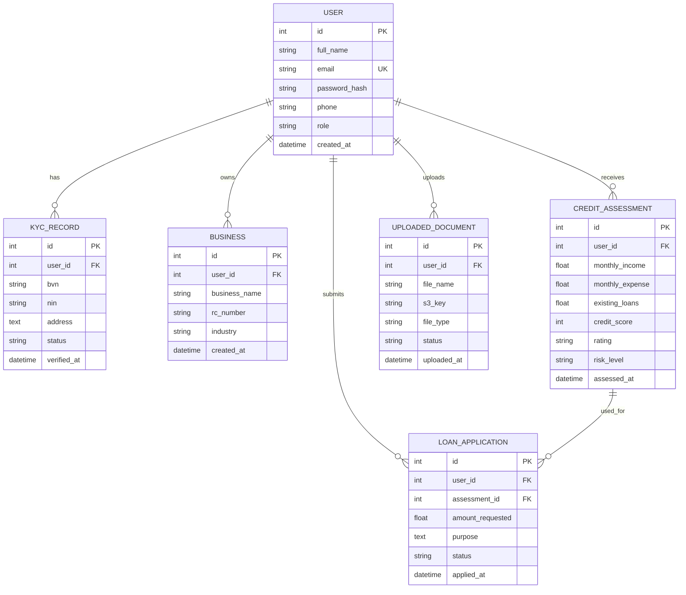

# CrediSure Database Design

## ER Diagram

```mermaid
erDiagram
    USER ||--o{ KYC_RECORD : has
    USER ||--o{ BUSINESS : owns
    USER ||--o{ CREDIT_ASSESSMENT : receives
    USER ||--o{ UPLOADED_DOCUMENT : uploads
    USER ||--o{ LOAN_APPLICATION : submits
    CREDIT_ASSESSMENT ||--o{ LOAN_APPLICATION : used_for

    USER {
        int id PK
        string full_name
        string email UK
        string password_hash
        string phone
        string role
        datetime created_at
    }

    KYC_RECORD {
        int id PK
        int user_id FK
        string bvn
        string nin
        text address
        string status
        datetime verified_at
    }

    BUSINESS {
        int id PK
        int user_id FK
        string business_name
        string rc_number
        string industry
        datetime created_at
    }

    CREDIT_ASSESSMENT {
        int id PK
        int user_id FK
        float monthly_income
        float monthly_expense
        float existing_loans
        int credit_score
        string rating
        string risk_level
        datetime assessed_at
    }

    UPLOADED_DOCUMENT {
        int id PK
        int user_id FK
        string file_name
        string s3_key
        string file_type
        string status
        datetime uploaded_at
    }

    LOAN_APPLICATION {
        int id PK
        int user_id FK
        int assessment_id FK
        float amount_requested
        text purpose
        string status
        datetime applied_at
    }
```

## Table Structure
All tables are designed with foreign key constraints and proper indexing!
